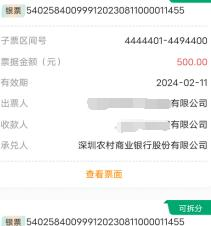

持有票据

$$
\begin{matrix} 2 0 2 3-1 1-2 7 \\ 2 0 2 4-1 0-2 7 \end{matrix} \sim 
$$

$$
\cong3 > 4 6 \sim 
$$

\mathrm{~ v}

| 眼票 54025840 | 120230811000011455 |
| 子票区间号 |  |
| 票据金额（元) | 800.00 |
| 有效期 | 2024-02-11 |
| 出票人 | 有限公司 |
| 收款人 | 有限公司 |
| 承兑人 | 农村商业银行股份有限公司 |

查看票面