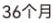
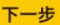

## 贷款申请

6®

## 贷款产品类型

$$
1_{2}=5 \pi 
$$

$$
E_{i}^{\pm} \textcircled{<} 8 \pi 
$$

## ￥最小申请额度为50,000.00元

可申请贷款金额 $3. 0 0 0, 0 0 0. 0 0 \pi$ 

$$
\because\pm\lambda=B B E 
$$

请输入验证码

请输入六位数的营销代码

营销 $\lambda$ 名称

请选择〉

