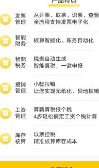

$$
\begin{array} {c} {{\downarrow}} \\ {{\downarrow}} \\ {{\downarrow}} \\ {{\downarrow}} \\ {{\downarrow}} \\ {{\downarrow}} \\ {{\downarrow}} \\ {{\downarrow}} \\ {{\downarrow}} \\ {{\downarrow}} \\ {{\downarrow}} \\ {{\downarrow}} \\ {{\downarrow}} \\ {{\downarrow}} \\ {{\downarrow}} \\ {{\downarrow}} \\ {{\downarrow}} \\ {{\downarrow}} \\ {{\downarrow}} \\ {{\downarrow}} \\ {{\downarrow}} \\ {{\downarrow}} \\ {{\downarrow}} \\ {{\downarrow}} \\ {{\downarrow}} \\ {{\downarrow}} \\ {\end{array} 
$$

$$
x+\Delta i t 
$$

智能生成凭证，实现税务风险检测和一键报税的票财税的一体智能云财务产品。

## 产品特点

