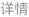
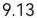

## 交易审核

审核进度

$$
\angle A B E A E 
$$

$$
3 \times3 k \frac{5} {5} 
$$

$$
5 2 0 5 5 7 0 0 5 
$$

$$
\textcircled{1} \times\frac{5} {2} \textcircled{2} \textcircled{3} 
$$

$$
8 6. 2 3 
$$

录入员：邓国祥

录入时间:2023-11-30 15:41:09

内部互转

$$
\frac{3} {1 1 6} > k \frac{5} {5} 
$$

$$
5 2 0 5 5 7 0 0 4 
$$

交易金额

录入员：邓国祥

## 录入时间:2023-11-30 15:40:44

内部互转

流水号

$$
5 2 0 5 5 7 0 0 3 
$$

$$
5 1 4. 0 0 
$$

录入员：邓国祥

录入时间:2023-11-30 15:40:16

内部互转

## 已选中4项总金额:1,260.36元