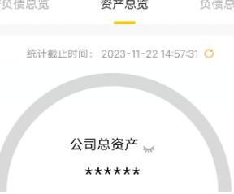

## 资产视图

\mathsf{<}

资产负债总览资产总览

统计截止时间：2023-11-22 14:57:31

注：所涉及相关资产信息可能会存在更新延迟等情况，仅供参考，不作为对账凭证。

活钱理财，提升公司收益

| 活期(含本外币火火大大大大 大女实火实火  | 定期(含本外币) 欢火欢火火卖 食老火肉实★  |
| 理财 ★京实实火卖 | 基金大大吉火火室 古南肉肉回肉 |

温磬提示：

1、活期（含本外币）：统计公司名下所有人民币及外币活期账户的余额；

 $\circ$ 、定期（含本外币）：大额存单包含在内：

3、基金：统计公司名下持有的所有基金产品金额，不包含在途的基金产品金额：

4、理财：统计公司名下持有的所有理财产品金额，不包含在途的
理财产品金额；

5、总资产涉及到的外市活期、外市定期存款、外市基金、外市理财等外币资产将会被折算成人民币资产统计。因汇率实时变动,请以实际牌价为准。
