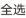

## 开票申请

\mathsf{<}

$$
\sharp\! \times\! 2 2 8 6 0 5. 2 1 
$$

贷款利息 1.46
$$
2 0 2 3-0 2-0 3 
$$
税率6%

贷款利息 2.66
$$
2 0 2 3-0 2-0 3 
$$
税率6%

贷款利息 0.01
$$
2 0 2 3-0 2-0 3 
$$
税率6%

贷款利息 4.05
$$
2 0 2 3-0 2-0 3 
$$
税率6%

税率6%
$$
\begin{matrix} 5 \times5 x+1=0 \\ 2 0 2 3-0 2-0 3 \end{matrix} 
$$
26.33

0.08

贷款利息
$$
2 0 2 3-0 2-0 3 
$$
税率0%

$$
7 6. 5 0 
$$
$$
\times\pi\cong6 9 6 
$$

贷款利息

$$
\begin{matrix} 1=\cdots\\ 2 0 2 3-0 2-0 3 \end{matrix} 
$$

已选中1项发票金额合计：，一元

