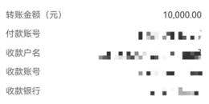

## 转账结果

## 提交成功，等待审核交易流水号：

## 提交成功

交易名称：跨行转账录入人员：
交易时间：

待审核

$$
- \pm\sqrt{2} \times\frac{3} {2}+\times\frac{3} {2} 
$$

待1人审核

$$
\left\{\xi\otimes\frac{\epsilon_{n}} {\epsilon_{n}} \right\} \equiv\left\{\frac{\epsilon_{n}} {\epsilon_{n}} \right\} 
$$

| 转 | 账金额（元) | 10,000.00 |
| --- | --- | --- |
| 付 | 款账号 |  |
| 收款户名 |
| 收 | 款账号 |  |
| 收 | 款银行 |  |
| 各注： | 本交易已受理， | 本界面不作为收款方人账凭让 |
| 转账记录 | 再转一笔电子回单 |
|  | 完成 |

备注：本交易已受理，本界面不作为收款方入账凭证

## 再转一笔

