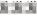

## 收款名册

## Q 请输入收款账号/户名/行名

＋创建组

＋添加新收款人

财源滚滚 $( 0 )$ 

$$
\mathbb{F} 
$$

中国工商银行(尾号)

$$
\textcircled{O}=\frac{\mathbb{H}=\frac{\pi} {\pi} \times\mathbb{H} \times\mathbb{H} \times\mathbb{H}} {\frac{\pi} {\pi} \times\mathbb{H}} 
$$

$$
\mathbf{\partial} 
$$

